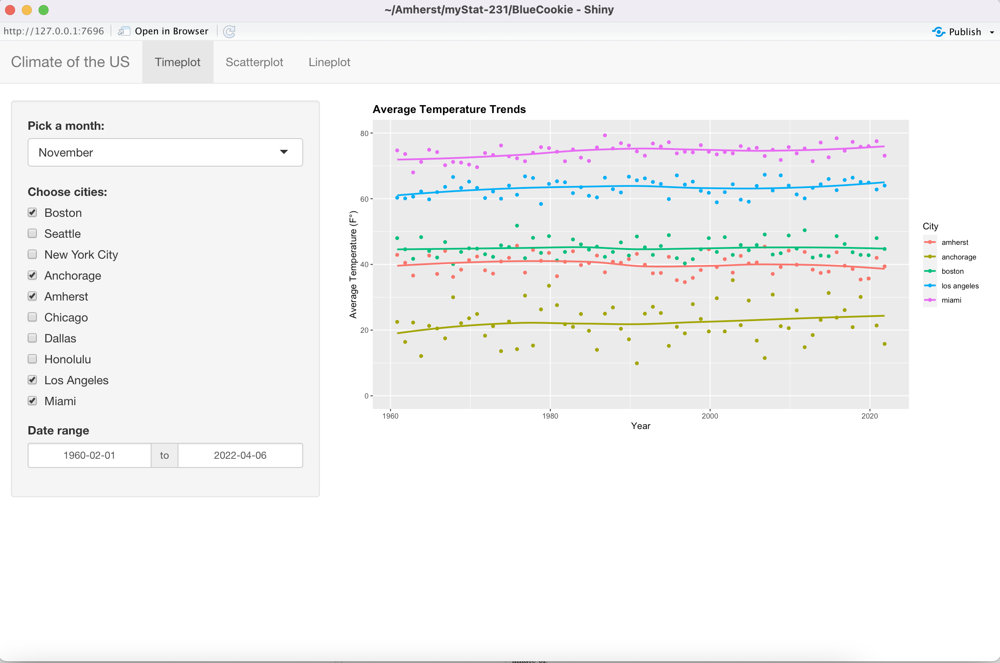

```{r include = FALSE}
library(kableExtra)
library(knitr)
```

<!--
Change the title to "Executive Summary for YOUR TITLE", 
and update the author field depending on your section, with your #
-->
### Link to published app: https://r.amherst.edu/apps/vnguyen24/ClimateProject231/

## Insights into Topic

<!-- What is your topic? Why was it interesting to you? What motivated it for you? -->

The purpose of our project was to explore the trends of temperature and climate over different regions of the United States. In particular, we looked at temperature and precipitation over the span of centuries and decades. This topic is interesting to us because in recent times, we face the issue of climate change which affects many ecosystems and environments. It will be interesting to see if the changes over the past decades in temperature and precipitation are visible and to what extent in varying regions.

## Data

<!-- Describe your data. Where did it come from? What are some of the variables? Include a citation for the data here. You may not have room to describe ALL the variables. Give a reference for someone to look at - maybe this information is in your app in an information tab! -->

In order to see the difference in climate from different regions in the US, we found data on variables relating to climate from specific cities scattered in different areas of the United States (including Alaska and Hawaii). The data we used were collected from the National Weather Service website (https://www.weather.gov/). Some variables in the data set are: `max_temp`: the maximum temperature (in °F) of a city for every month. This value is chosen by taking the highest maximum temperature among all of the days in a month; `min_temp`: the minimum temperature (in °F) of a city for every month. This value is chosen by taking the lowest minimum temperature among all of the days in a month; `avg_temp`: the average temperature (in °F) of a city for every month. This value is calculated by taking the mean of average temperatures for every day in a month; `precipitation`: the precipitation (in inches) of a city for every month. This value is calculated by taking the sum of precipitation for everyday in a month.

The data can be collected at (https://www.weather.gov/wrh/Climate?wfo=box/) by clicking on the regions of interest and filtering for different years, variables, types of calculating output.

## Shiny App
<!-- What does your app allow someone to do with the data? What visuals are included and why? This is a high level discussion, not details about why you used certain visual cues or choose a certain color scheme. -->

Our app has 3 interactive widgets: a time plot, a scatter plot, and a line graph.

The timeplot allows users to compare the average temperature of a specific month of different cities over a date range of their choice. This plot lets the user be able to see how average temperature fluctuates over a long period of time to better see the trends. It is important to compare the same month to the same month or we would see natural fluctuations due to different seasons. A line of best-fit was included to help the user see any trends in regression. Overall, a time plot was a good addition because in order to see patterns, we need to analyze the data over a long interval of time.

The scatter plot allows users to choose a desired year (from 1869 to 2022). Then, this interactive value will be fed into the code, which will automatically filter and update which year to display (default is 2002). Users can then choose variables of interest for both the x and y axis to explore their relationship. These two interactive values will also be fed into the server, which will re-plot whenever users re-pick their choices. The main visual in this widget is a scatter plot. We chose to include a scatter plot because looking at the relationship between different variables is essentially a bivariate analysis, which is a topic that the scatter plot can convey findings effectively. 

The line plot allows the user to see the change in precipitation over a period of time for a chosen city. As with the time plot, this line plot is helpful to the user because we can distinguish any changes in the annual precipitation rate over the past decades. 

<!-- At least one image of the app is required to demonstrate its functionality. This can be in this section or the next, as you deem appropriate. Remember that figures can be resized. -->

```{r, out.width = '75%', echo = FALSE}

```

## Results

<!-- What did you learn in regards to your topic of interest? -->
Through the plots that were created over time (the time plot and the line plot), we were able to see the trend of average temperature and precipitation over the past couple of decades and past century. It appears that on average, the average temperature seems to have slightly increased over in relatively recent years for many of the cities. There are slight fluctuation in the trends, but many of them trend upwards. This means that the average temperatures across the whole country are rising. We also found that the precipitation is slightly rising in some cities (such as Dallas or Amherst), or slightly decreasing in other cities (such as New York City or Los Angeles). These trends are more difficult to see due to the higher variability in annual precipitation measurements and the data from more cities is most likely needed to make any conclusions.

Through the scatterplot and among different variable pairs, we found out that cities with higher `min_temp` tend to have higher `avg_temp`, and this trend seems to hold throughout the years. Another moderate, positively correlated pair is `max_temp` and `avg_temp`: the higher `max_temp` a city has, the higher `avg_temp` it would have.  What we found is expected as it is generally true that cities with higher temperatures (either minimum or maximum) would end up having higher mean temperatures. There doesn't seem to be a discernible trend for other pairs. However, there is a weak positive correlation between `avg_temp` and `precipitation`. This tells us that cities with higher average temperature will have more precipitation, which is a bit counter intuitive. However, it is just a weak correlation, so this might not accurately reflect real life climate.


<!-- Remember: This executive summary must be at most 2 pages long. Presenting information concisely is also a great skill for data scientists to have. The compiled .pdf of the executive summary should be submitted in your group repo for the project. -->